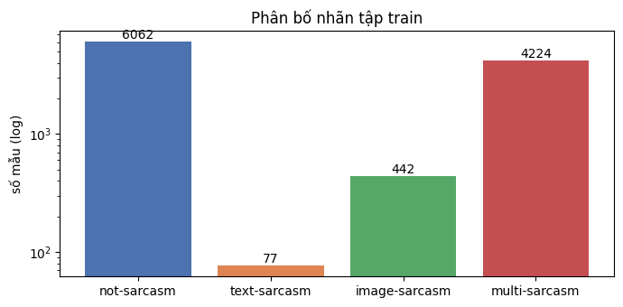
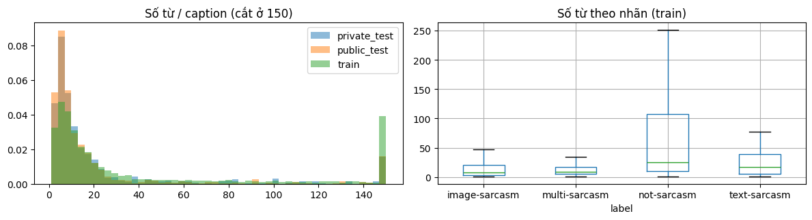
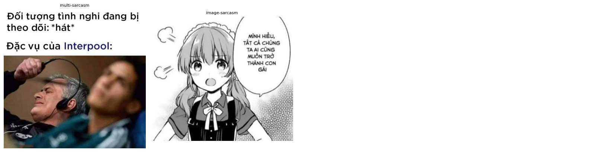
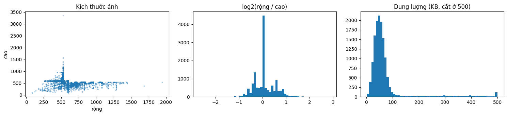
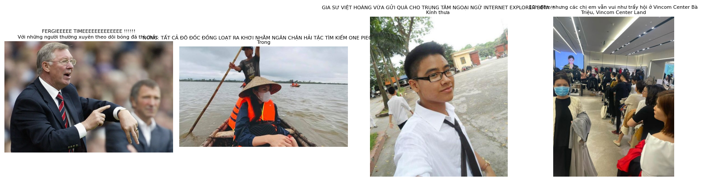
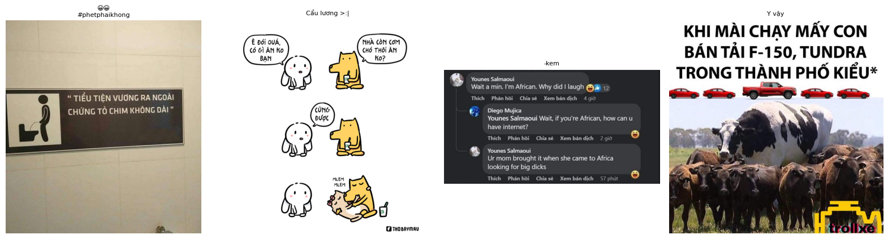
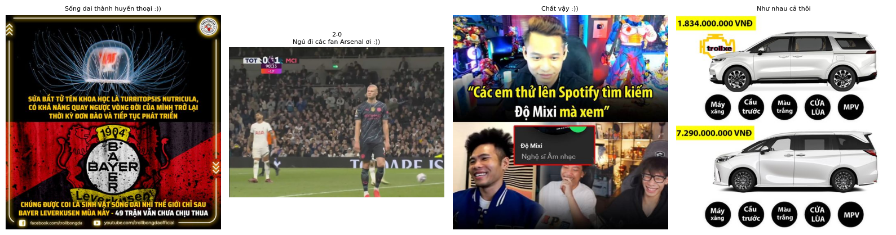
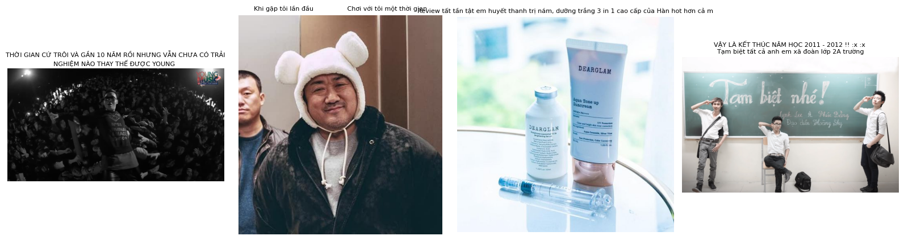

# Báo cáo kiểm tra bộ dữ liệu ViMMSD

- **Nguồn dữ liệu:** Kaggle dataset [`hhhoang/vimmsd-dataset`](https://www.kaggle.com/datasets/hhhoang/vimmsd-dataset) (bản 1, khoảng 1 GB)
- **Công cụ:** `notebooks/00_dataset_check.ipynb`, chạy trên Kaggle ngày 26/09/2026. Kết quả thô lưu ở `working/dataset_check.json`
- **Phạm vi:** toàn bộ 3 file annotation và 13.722 ảnh (mọi ảnh đều được mở và giải mã)

---

## 1. Tóm tắt

Dữ liệu **sạch về mặt cấu trúc**: đủ file, không thiếu ảnh, không có ảnh lỗi, không có nhãn lạ, định dạng annotation khớp với code. Có thể dùng ngay cho pipeline.

Các vấn đề ảnh hưởng tới thiết kế thí nghiệm, xếp theo mức độ quan trọng:

| # | Vấn đề | Mức độ | Ảnh hưởng |
|---|---|---|---|
| 1 | Lớp `text-sarcasm` chỉ có **77 mẫu** (0,71%), chênh **78,7 lần** so với lớp lớn nhất | Cao | Tập val/test chỉ có khoảng 8 mẫu của lớp này, F1 của lớp dao động mạnh theo seed, kéo theo macro-F1 không ổn định |
| 2 | **26,5% mẫu train có caption trùng** (697 nhóm), 123 nhóm trùng caption nhưng khác nhãn | Cao | Chia val/test ngẫu nhiên gây rò rỉ text giữa các tập, điểm val cao hơn thực tế |
| 3 | **Phân phối train khác test**: caption ở test ngắn hơn một nửa, nhiều emoticon và URL hơn | Cao | Điểm trên val (chia từ train) có thể không phản ánh điểm trên public/private test |
| 4 | 42 nhóm **ảnh trùng hoàn toàn** (md5), 20 nhóm nằm ở nhiều split, 9 nhóm trong train khác nhãn | Trung bình | Rò rỉ ảnh giữa train và test |
| 5 | 12% caption dài hơn 128 từ, chủ yếu thuộc `not-sarcasm` | Trung bình | Bị cắt bớt với `max_length: 128`; độ dài caption có thể trở thành "đường tắt" để đoán nhãn |
| 6 | 271 caption chứa HTML entity (`&amp;`, `&gt;`, `&lt;`), 72 caption chưa chuẩn Unicode NFC | Thấp | Cần bổ sung `html.unescape` vào tiền xử lý |
| 7 | 72 ảnh có tỉ lệ khung > 3:1, 7 ảnh cạnh nhỏ hơn 100px | Thấp | CLIP center crop cắt mất phần lớn nội dung các ảnh dài |

**Đã sửa ngay:** đường dẫn dữ liệu trên Kaggle là `/kaggle/input/datasets/hhhoang/vimmsd-dataset` (khác giá trị giả định `/kaggle/input/vimmsd-dataset` trước đó). Đã cập nhật `paths.kaggle.data_dir` trong `configs/base.yaml` và `data/README.md`.

---

## 2. Cấu trúc và tính toàn vẹn

| Thành phần | Số lượng | Dung lượng | Nhãn |
|---|---|---|---|
| `vimmsd-train.json` + `training-images/train-images/` | 10.805 mẫu | 864,6 MB ảnh | có |
| `vimmsd-public-test.json` + `public-test-images/dev-images/` | 1.413 mẫu | 81,7 MB ảnh | không (`label: null`) |
| `vimmsd-private-test.json` + `private-test-images/test-images/` | 1.504 mẫu | 81,1 MB ảnh | không (`label: null`) |

Tất cả kiểm tra toàn vẹn đều đạt:

- Annotation có dạng `{id: {"image", "caption", "label"}}`, mọi mẫu đủ 3 trường, khớp với `load_records` trong `src/vimmsd/data/dataset.py`.
- Id trong train không trùng; nhãn train chỉ thuộc 4 lớp đã biết; không có nhãn rỗng.
- Không có caption rỗng hoặc sai kiểu dữ liệu.
- Mọi ảnh được tham chiếu đều tồn tại (thiếu 0/10.805, 0/1.413, 0/1.504), không có file ảnh thừa, mỗi ảnh chỉ thuộc 1 mẫu, không trùng tên ảnh giữa các split.
- Toàn bộ 13.722 ảnh mở và giải mã được, không có ảnh động.

Hai tập test **đều không có nhãn**, vì vậy val/test để đánh giá phải chia từ tập train (config hiện tại chia stratified 80/10/10).

---

## 3. Phân bố nhãn

| Nhãn | Số mẫu | Tỉ lệ | Dự kiến val (10%) | Dự kiến test (10%) |
|---|---|---|---|---|
| not-sarcasm | 6.062 | 56,10% | 606 | 606 |
| text-sarcasm | **77** | **0,71%** | **8** | **8** |
| image-sarcasm | 442 | 4,09% | 44 | 44 |
| multi-sarcasm | 4.224 | 39,09% | 422 | 422 |

**Nhận xét:**

- Mất cân bằng rất nặng: lớp lớn nhất gấp 78,7 lần lớp nhỏ nhất. Một model chỉ đoán `not-sarcasm` đạt accuracy 56% nhưng macro-F1 chỉ khoảng 0,18, nên **bắt buộc dùng macro-F1** như README đã định.
- Với khoảng 8 mẫu `text-sarcasm` trong val, chỉ cần đoán đúng/sai thêm 1 mẫu là recall của lớp thay đổi khoảng 12,5 điểm, và macro-F1 thay đổi theo. So sánh hai model chênh nhau vài điểm macro-F1 trên một lần chia là **không đáng tin cậy**.
- `image-sarcasm` (442 mẫu) cũng là lớp thiểu số, không chỉ riêng `text-sarcasm`.

---

## 4. Caption

### 4.1. Độ dài

| | Trung bình (từ) | Trung vị | 75% | Lớn nhất |
|---|---|---|---|---|
| train | 50,7 | 15 | 54 | 846 |
| public_test | 26,1 | 8 | 16 | 708 |
| private_test | 27,7 | 8 | 18 | 513 |

| Nhãn (train) | Trung bình | Trung vị | 75% |
|---|---|---|---|
| not-sarcasm | 72,0 | 25 | 107 |
| text-sarcasm | 45,7 | 17 | 39 |
| image-sarcasm | 32,8 | 8 | 21 |
| multi-sarcasm | 22,2 | 9 | 17 |

**Nhận xét:**

- **Độ dài phụ thuộc mạnh vào nhãn.** `not-sarcasm` thường là bài báo/quảng cáo dài (3 caption dài nhất, 800–846 từ, đều là tin tức sức khỏe hoặc đời sống); `image-sarcasm` và `multi-sarcasm` thường là caption meme rất ngắn (trung vị 8–9 từ). Model có thể học đường tắt "caption dài → không mỉa mai" mà không cần hiểu nội dung. Cần đưa yếu tố này vào phần phân tích shortcut learning (Tuần 6).
- **Caption ở hai tập test ngắn hơn train khoảng một nửa** (trung vị 8 so với 15 từ). Tập test có vẻ chứa tỉ lệ meme cao hơn, tức phân bố nhãn ở test có thể khác train (không kiểm chứng được vì test không có nhãn).
- 20% caption dài hơn 64 từ, 12% dài hơn 128 từ. Với `max_length: 128` token (1 từ ≈ 1,3–1,5 subword PhoBERT), khoảng 15–20% caption sẽ bị cắt, gần như toàn bộ thuộc `not-sarcasm`.

### 4.2. Hiện tượng cần tiền xử lý

Tỉ lệ % caption có hiện tượng:

| Hiện tượng | train | public_test | private_test |
|---|---|---|---|
| HTML entity (`&amp;` …) | 2,1 | 1,6 | 1,7 |
| URL | 1,7 | **7,0** | **8,8** |
| hashtag | 22,4 | 21,3 | 20,9 |
| emoji | **30,7** | 17,3 | 19,2 |
| emoticon (`=)))`, `:)))`) | 7,9 | **25,5** | **24,3** |
| chữ lặp (`quáaaa`) | 4,3 | 3,4 | 3,1 |
| xuống dòng | 53,3 | 34,3 | 35,1 |
| Unicode chưa chuẩn NFC | 0,5 | 0,4 | 0,7 |

Theo nhãn trong train:

| Hiện tượng | not-sarcasm | text-sarcasm | image-sarcasm | multi-sarcasm |
|---|---|---|---|---|
| HTML entity | 2,8 | 6,5 | 3,2 | 0,7 |
| URL | 2,1 | 0,0 | 4,5 | 0,9 |
| hashtag | 20,3 | 22,1 | **37,6** | 23,8 |
| emoji | 33,7 | 29,9 | 25,6 | 26,8 |
| emoticon | 5,7 | **18,2** | 9,7 | 10,8 |
| xuống dòng | 61,6 | 54,5 | 55,4 | 41,3 |

**Nhận xét:**

- **Emoticon kiểu `=)))`, `:)))` phổ biến ở test gấp 3 lần train**, và tỉ lệ cao nhất ở `text-sarcasm` (18,2%). Đây là tín hiệu mỉa mai quan trọng trong tiếng Việt nên phải **giữ lại** khi tiền xử lý. Hàm `collapse_repeats` hiện chỉ rút gọn chữ cái nên không ảnh hưởng tới chúng (`=)))` vẫn giữ nguyên).
- URL ở test nhiều gấp 4–5 lần train. Pipeline hiện xóa URL nên không gây lệch.
- `image-sarcasm` có tỉ lệ hashtag cao nhất (37,6%). Nhiều hashtag là tên trang meme (`#interpool`, `#WMO`, `#WorldMemeOrganization`), tức là **nguồn đăng bài** chứ không phải nội dung. Đây là một đường tắt tiềm năng khác cần kiểm tra.
- 271 caption chứa HTML entity: `&amp;` 260 lần, `&gt;` 80 lần, `&lt;` 37 lần. Ví dụ: `“lớp du tu dờ mun” &amp; cant back.` Pipeline hiện chưa xử lý, cần thêm `html.unescape`.
- 72 caption chưa chuẩn NFC. Pipeline đã chuẩn hóa NFC nên không cần xử lý thêm.
- Emoji phổ biến nhất: ❤ (435), 🔥 (359), 🤣 (247), 🥰 (203), 😍 (198). Có các ký tự thành phần như ký tự bổ nghĩa màu da U+1F3FB (194 lần) và hai ký tự chỉ báo vùng U+1F1FB, U+1F1F3 (cờ Việt Nam bị tách thành 2 ký tự) cần được xử lý đúng khi chuyển emoji thành chữ.

---

## 5. Caption trùng lặp

- **2.860 mẫu train (26,5%)** có caption trùng với ít nhất một mẫu khác, thuộc **697 nhóm**.
- **123 nhóm** trùng caption nhưng khác nhãn. Ví dụ `:))` xuất hiện 34 lần với 3 nhãn khác nhau (multi 12, not 11, image 11); `-kem` xuất hiện 23 lần với cả 4 nhãn.
- Các nhóm lớn chủ yếu là caption rất ngắn của meme (`:))`, `=))`, `Ủa`, `😭😭😭`) và caption gắn tag trang meme (`- Elsa #interpool #WMO …`, 24 lần, 21 lần là `image-sarcasm`).
- Có nhóm là cùng một bài báo đăng kèm nhiều ảnh khác nhau (ví dụ tin Xiumin (EXO) 10 lần, đều `not-sarcasm`).
- Nếu chỉ tra bảng "caption → nhãn phổ biến nhất trong nhóm", ta đoán đúng **93,6%** các mẫu có caption trùng.
- 52/1.413 (3,7%) caption của public test và 68/1.504 (4,5%) caption của private test đã xuất hiện trong train.

*Cùng caption `#Interpool -Ivan`, ảnh bên trái được gán `multi-sarcasm`, ảnh bên phải `image-sarcasm`: nhãn do ảnh quyết định.*

**Nhận xét:**

- Trùng caption với ảnh khác là đặc trưng tự nhiên của dữ liệu meme, không phải lỗi. Chính các nhóm trùng caption khác nhãn là nơi **thông tin ảnh bắt buộc phải dùng**, nên đây là tập con rất tốt để đánh giá model có thực sự dùng ảnh hay không.
- Vấn đề nằm ở **cách chia val/test**: chia stratified ngẫu nhiên như hiện tại sẽ đặt các mẫu cùng nhóm caption vào cả train lẫn val/test. Với 93,6% nhóm có nhãn nhất quán, model chỉ cần "nhớ" caption là đạt điểm cao trên val, nên điểm val sẽ **cao hơn thực tế**. Mức trùng giữa train và test thật chỉ 3,7–4,5%, thấp hơn nhiều so với khi chia ngẫu nhiên, nên khoảng cách giữa điểm val và điểm test sẽ lớn.

---

## 6. Ảnh

| | Rộng (trung vị) | Cao (trung vị) | Tỉ lệ rộng/cao (min – max) | Dung lượng TB |
|---|---|---|---|---|
| train | 526 | 526 | 0,16 – 6,38 | 78 KB |
| public_test | 526 | 527 | 0,37 – 4,35 | 56 KB |
| private_test | 526 | 528 | 0,43 – 7,25 | 53 KB |

**Nhận xét:**

- Ảnh khá đồng nhất: trung vị 526×526, phần lớn gần vuông (đỉnh nhọn tại tỉ lệ 1:1). Nhiều khả năng ảnh đã được resize khi thu thập. Kích thước này lớn hơn nhiều so với đầu vào 224×224 của CLIP nên không thiếu độ phân giải.
- **1.265 ảnh (9,2%) là PNG nhưng có đuôi `.jpg`** (train 1.101, public 69, private 95). PIL đọc theo nội dung file nên không gây lỗi; chỉ cần lưu ý nếu dùng thư viện đọc ảnh theo đuôi file.
- 3 ảnh thang xám (mode `L`), còn lại đều RGB. Dataset đã convert sang RGB nên không cần xử lý.
- 7 ảnh có cạnh nhỏ hơn 100px (nhỏ nhất 80px): ít, không đáng kể.
- **72 ảnh có tỉ lệ > 3:1** (dài nhất 0,16, tức cao gấp 6 lần rộng, 520×3.360px). CLIP resize cạnh ngắn rồi center crop hình vuông, nên các ảnh này (thường là ảnh chụp chuỗi bình luận hoặc meme nhiều khung) mất phần lớn nội dung.
- **Ảnh trùng hoàn toàn (md5):** 84 file thuộc 42 nhóm; 20 nhóm xuất hiện ở nhiều split (train–public, train–private, public–private); 9 nhóm trong train có nhãn khác nhau (ví dụ not/multi, not/text). Cùng một ảnh với caption khác cho nhãn khác là hợp lý (nhãn phụ thuộc cả text), nhưng ảnh trùng giữa train và val/test cũng là một dạng rò rỉ. Kiểm tra md5 chỉ bắt được ảnh giống từng byte; ảnh gần giống (resize, nén lại, cắt viền) chưa được phát hiện, nên số ảnh trùng thực tế có thể cao hơn.

---

## 7. Quan sát định tính từ mẫu

**text-sarcasm**: ảnh là ảnh chụp bình thường (người, cảnh vật), sự mỉa mai nằm trong caption:

**image-sarcasm**: phần lớn là meme **có chữ trong ảnh** (biển báo, truyện tranh, ảnh chụp bình luận Facebook, meme có tiêu đề):

**multi-sarcasm**: meme/ảnh chụp màn hình có chữ, caption ngắn kèm emoticon `:))`:

**not-sarcasm**: ảnh sự kiện, quảng cáo, tin tức, caption dài:

**Nhận xét:**

- Ở `image-sarcasm` và `multi-sarcasm`, **nội dung mỉa mai thường nằm trong chữ xuất hiện trên ảnh**. CLIP chỉ đọc được chữ trong ảnh ở mức hạn chế, nên **OCR (Tuần 7) nhiều khả năng mang lại cải thiện rõ** và nên được ưu tiên hơn mức "nếu còn thời gian" trong README.
- Có ảnh chữ tiếng Anh (ảnh chụp bình luận), nên OCR cần hỗ trợ cả tiếng Việt lẫn tiếng Anh.
- Ranh giới giữa `image-sarcasm` và `multi-sarcasm` khó phân biệt ngay cả khi nhìn bằng mắt: cả hai đều là meme có chữ, caption ngắn. Nhiều khả năng đây là cặp lớp model nhầm lẫn nhiều nhất.

---

## 8. Đề xuất

### Cần làm trước khi train (ảnh hưởng tới độ tin cậy của mọi kết quả)

1. **Chia val/test theo nhóm để tránh rò rỉ.** Gom nhóm các mẫu trùng caption hoặc trùng ảnh (md5), rồi chia bằng `StratifiedGroupKFold` để một nhóm chỉ nằm trong một tập, đồng thời vẫn giữ tỉ lệ nhãn. Cần sửa `split_records` trong `src/vimmsd/data/dataset.py`.
2. **Đánh giá bằng nhiều lần chia** (k-fold hoặc ít nhất 3 seed) và báo cáo trung bình ± độ lệch chuẩn của macro-F1, vì `text-sarcasm` chỉ có khoảng 8 mẫu trong mỗi tập đánh giá. Báo cáo F1 từng lớp cạnh macro-F1.
3. **Bổ sung `html.unescape` vào `clean_text`** (`src/vimmsd/data/preprocessing.py`), đặt trước bước xóa URL/hashtag.

### Nên làm

4. **Tăng `max_length` lên 256** (giới hạn của PhoBERT), hoặc giữ phần đầu và phần cuối caption thay vì chỉ cắt đuôi, rồi so sánh.
5. **Đưa OCR lên sớm hơn**, vì mẫu `image-sarcasm`/`multi-sarcasm` phụ thuộc nhiều vào chữ trong ảnh.
6. **Mở rộng phần kiểm tra shortcut (Tuần 6)** với các đường tắt phát hiện được ở đây:
    - baseline chỉ dùng độ dài caption và hashtag để xem đạt bao nhiêu macro-F1;
    - đánh giá riêng trên nhóm "trùng caption khác nhãn", nơi model buộc phải dùng ảnh.
7. **Xử lý emoji ghép**: giữ nguyên cờ 🇻🇳 và bỏ ký tự màu da (U+1F3FB–1F3FF) trước khi chuyển emoji thành chữ; giữ emoticon `=)))` vì là tín hiệu mỉa mai.
8. **Thêm private test vào config** (`private_test_json`, `private_test_image_dir`) để xuất dự đoán cho cả hai tập test.

### Có thể làm (ảnh hưởng nhỏ)

9. Pad ảnh thành hình vuông thay vì center crop cho 72 ảnh tỉ lệ > 3:1.
10. Dùng perceptual hash (pHash) để phát hiện ảnh gần giống, bổ sung cho md5.
11. Theo dõi khác biệt phân phối train/test: so sánh phân bố nhãn dự đoán trên public test với phân bố nhãn train, để phát hiện sớm nếu model lệch.

---

## Phụ lục: kết quả 43 kiểm tra tự động

| Kiểm tra | Kết quả | Chi tiết |
|---|---|---|
| Có đủ 3 file annotation | OK | |
| Mọi mẫu có đủ image/caption/label (3 split) | OK | 10.805 / 1.413 / 1.504 mẫu |
| train: id không trùng | OK | |
| train: không có nhãn rỗng, nhãn thuộc 4 lớp | OK | |
| public/private test: không có nhãn | OK | toàn bộ `null` |
| Caption là chuỗi, không rỗng (3 split) | OK | |
| Có thư mục ảnh, không thiếu ảnh, không có ảnh thừa (3 split) | OK | thiếu 0 |
| Mỗi ảnh chỉ thuộc 1 mẫu, không trùng tên ảnh giữa các split | OK | |
| Mọi lớp có ≥ 50 mẫu | OK | ít nhất: text-sarcasm = 77 |
| Caption không chứa HTML entity | CHÚ Ý | 271 caption |
| Caption đã chuẩn Unicode NFC | CHÚ Ý | 72 caption |
| train: không có caption trùng | CHÚ Ý | 2.860 mẫu (26,5%), 697 nhóm |
| train: caption trùng có cùng nhãn | CHÚ Ý | 123 nhóm khác nhãn |
| Mọi ảnh mở được | OK | 0 ảnh lỗi |
| Đuôi file khớp định dạng thật | CHÚ Ý | 1.265 ảnh PNG đuôi `.jpg` |
| Không có ảnh động | OK | |
| Không có ảnh quá nhỏ (< 100px) | CHÚ Ý | 7 ảnh |
| Không có ảnh tỉ lệ cực đoan (> 3:1) | CHÚ Ý | 72 ảnh |
| Không có ảnh trùng nội dung (md5) | CHÚ Ý | 84 file, 42 nhóm |
